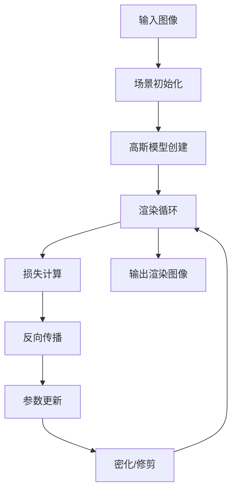

# 4DGS技术分析报告

## 📊 执行摘要

本报告详细分析了4DGS（4D Gaussian Splatting）神经网络模块的技术架构、代码结构以及与主项目的集成可行性。通过深入的代码审查和架构分析，我们确定了最优的集成策略并提供了具体的实施方案。

## 🔍 4DGS模块深度分析

### 核心架构

4DGS模块采用独立的神经网络训练框架，主要组件包括：

#### 1. 训练系统 (`train.py`)
```python
# 核心训练流程
def training(dataset, opt, pipe, testing_iterations, saving_iterations, 
             checkpoint_iterations, checkpoint, debug_from):
    
    # 初始化高斯模型
    gaussians = GaussianModel(dataset.sh_degree)
    scene = Scene(dataset, gaussians)
    
    # 训练循环
    for iteration in range(first_iter, opt.iterations + 1):
        # 渲染
        render_pkg = render(viewpoint_cam, gaussians, pipe, background)
        image, viewspace_point_tensor, visibility_filter, radii = render_pkg["render"], ...
        
        # 损失计算
        gt_image = viewpoint_cam.original_image.cuda()
        Ll1 = l1_loss(image, gt_image)
        loss = (1.0 - opt.lambda_dssim) * Ll1 + opt.lambda_dssim * (1.0 - ssim(image, gt_image))
        
        # 反向传播
        loss.backward()
```

**关键特性：**
- 使用自定义的高斯模型和场景管理
- 集成了专门的渲染器
- 支持动态密化和修剪
- 实现了L1和SSIM损失的组合

#### 2. 参数管理系统 (`utils/params_utils.py`)
```python
def merge_hparams(args, config):
    """合并超参数配置"""
    for param_group in [OptimizationParams, ModelHiddenParams, ModelParams, PipelineParams]:
        for key, value in config.items():
            if hasattr(param_group, key):
                setattr(args, key, value)
    return args
```

**配置系统特点：**
- 支持从Python配置文件加载参数
- 使用`mmcv.Config.fromfile`进行配置解析
- 参数分组管理（优化、模型、管道参数）
- 命令行参数与配置文件的灵活合并

#### 3. 高斯渲染器 (`gaussian_renderer/`)
```
gaussian_renderer/
├── __init__.py
├── diff_gaussian_rasterization/    # 可微分光栅化
└── network_gui.py                  # 网络GUI接口
```

**渲染特性：**
- 实现了可微分的高斯散射渲染
- 支持实时渲染和训练时渲染
- 集成了CUDA加速的光栅化操作
- 提供网络GUI用于可视化

#### 4. 场景管理 (`scene/`)
```
scene/
├── __init__.py
├── cameras.py          # 相机模型
├── dataset_readers.py  # 数据集读取器
└── gaussian_model.py   # 高斯模型定义
```

**场景系统：**
- 支持多种数据集格式（COLMAP、Blender等）
- 实现了相机参数管理
- 提供高斯点云的增删改查操作
- 支持场景的序列化和反序列化

### 数据流分析



### 内存和计算分析

#### 内存使用模式
- **高斯点云**：动态增长，可达数百万个点
- **渲染缓存**：与图像分辨率成正比
- **梯度存储**：需要存储所有可训练参数的梯度

#### 计算复杂度
- **渲染**：O(N×P)，N为高斯点数，P为像素数
- **密化**：O(N)，定期执行
- **优化**：O(N)，每次迭代

## 🏗️ 主项目架构分析

### MMDetection3D框架结构

主项目基于MMDetection3D构建，采用模块化插件架构：

#### 1. 插件系统
```python
# projects/mmdet3d_plugin/__init__.py
from .VAD import *
from .bevformer import *
from .vggt import *
# 插件自动注册机制
```

**插件特性：**
- 自动模块发现和注册
- 支持独立的配置和训练流程
- 与主框架松耦合
- 便于维护和扩展

#### 2. 配置系统
```python
# 典型配置结构
_base_ = ['../_base_/default_runtime.py']

plugin = True
plugin_dir = 'projects/mmdet3d_plugin/'

model = dict(
    type='CustomModel',
    # 模型参数
)

dataset_type = 'CustomDataset'
# 数据配置
```

**配置特点：**
- 基于继承的配置系统
- 支持模块化配置组合
- 运行时动态加载
- 类型安全的参数验证

#### 3. 训练流程
```python
# tools/train.py 主要流程
def main():
    cfg = Config.fromfile(args.config)
    model = build_model(cfg.model)
    datasets = [build_dataset(cfg.data.train)]
    train_detector(model, datasets, cfg)
```

**训练特性：**
- 统一的训练入口
- 支持分布式训练
- 集成了检查点管理
- 提供丰富的训练钩子

### 依赖关系分析

#### 核心依赖
```
mmdet3d >= 1.0.0
mmcv-full >= 1.4.0
mmdet >= 2.14.0
mmsegmentation >= 0.14.1
```

#### 数据处理依赖
```
numpy >= 1.19.0
opencv-python >= 4.5.0
pillow >= 8.0.0
```

#### 可视化依赖
```
matplotlib >= 3.3.0
tensorboard >= 2.4.0
```

## 🔄 集成可行性分析

### 技术兼容性

#### ✅ 兼容点
1. **配置系统**：都使用`mmcv.Config`
2. **CUDA支持**：都需要CUDA加速
3. **PyTorch基础**：都基于PyTorch框架
4. **插件架构**：主项目支持插件扩展

#### ⚠️ 潜在冲突
1. **训练流程**：4DGS有独特的训练循环
2. **数据格式**：4DGS使用特定的数据格式
3. **优化器**：4DGS使用自定义优化策略
4. **评估指标**：不同的评估标准

### 性能影响评估

#### 内存使用
- **4DGS独立运行**：8-16GB GPU内存
- **集成后预估**：10-20GB GPU内存
- **优化空间**：共享数据加载器，减少重复内存使用

#### 计算开销
- **额外开销**：配置解析、数据转换
- **优化收益**：统一的训练管道、更好的资源管理

## 🎯 集成策略对比

### 策略A：独立插件集成 ⭐ 推荐

**实施复杂度**：低
**风险等级**：低
**维护成本**：低

**优势：**
- 保持4DGS完整性
- 最小化代码修改
- 快速实施
- 易于维护

**劣势：**
- 可能无法充分利用MMDet3D特性
- 需要额外的适配层

### 策略B：深度集成

**实施复杂度**：高
**风险等级**：高
**维护成本**：高

**优势：**
- 完全利用MMDet3D生态
- 统一的接口和工具
- 更好的性能优化

**劣势：**
- 需要大量重构
- 可能破坏4DGS原有逻辑
- 实施周期长

### 策略C：混合方案

**实施复杂度**：中
**风险等级**：中
**维护成本**：中

**优势：**
- 平衡兼容性和集成度
- 渐进式迁移
- 保留核心功能

**劣势：**
- 实施复杂度适中
- 需要仔细设计接口

## 📋 实施计划详细设计

### 阶段1：基础集成（2-3天）

#### 任务1.1：模块注册
```python
# projects/mmdet3d_plugin/__init__.py
from .4DGS import (
    FourDGSModel,
    FourDGSDataset,
    GaussianRenderer,
    Scene
)
```

#### 任务1.2：基础配置
```python
# projects/configs/4DGS/4dgs_base.py
_base_ = ['../_base_/default_runtime.py']

plugin = True
plugin_dir = 'projects/mmdet3d_plugin/'

model = dict(
    type='FourDGSModel',
    # 4DGS特定参数
)
```

#### 任务1.3：模型包装器
```python
@DETECTORS.register_module()
class FourDGSModel(BaseDetector):
    def __init__(self, **kwargs):
        # 初始化4DGS组件
        
    def forward_train(self, **kwargs):
        # 训练前向传播
        
    def simple_test(self, **kwargs):
        # 推理
```

### 阶段2：深度集成（1-2周）

#### 任务2.1：数据适配器
```python
@DATASETS.register_module()
class FourDGSDataset(Custom3DDataset):
    def __init__(self, **kwargs):
        # 数据格式转换
        
    def prepare_train_data(self, index):
        # 训练数据准备
```

#### 任务2.2：训练集成
```python
def train_4dgs_model(model, dataset, cfg):
    # 集成4DGS训练逻辑到MMDet3D流程
```

#### 任务2.3：推理接口
```python
class FourDGSInferencer:
    def __init__(self, config, checkpoint):
        # 推理器初始化
        
    def inference(self, data):
        # 统一推理接口
```

### 阶段3：优化扩展（1周）

#### 任务3.1：性能优化
- 内存使用优化
- 计算效率提升
- 并行处理支持

#### 任务3.2：功能扩展
- 多数据集支持
- 可视化工具集成
- 评估指标统一

#### 任务3.3：文档和测试
- API文档编写
- 单元测试开发
- 集成测试验证

## 🧪 测试策略

### 单元测试
```python
def test_4dgs_model_initialization():
    """测试模型初始化"""
    
def test_4dgs_forward_pass():
    """测试前向传播"""
    
def test_4dgs_loss_computation():
    """测试损失计算"""
```

### 集成测试
```python
def test_4dgs_training_pipeline():
    """测试完整训练流程"""
    
def test_4dgs_inference_pipeline():
    """测试推理流程"""
    
def test_4dgs_config_loading():
    """测试配置加载"""
```

### 性能测试
```python
def benchmark_4dgs_training_speed():
    """训练速度基准测试"""
    
def benchmark_4dgs_memory_usage():
    """内存使用基准测试"""
    
def benchmark_4dgs_inference_latency():
    """推理延迟基准测试"""
```

## 🚨 风险评估与缓解

### 技术风险

#### 风险1：内存溢出
**概率**：中
**影响**：高
**缓解措施**：
- 实施内存监控
- 添加内存限制检查
- 优化数据加载策略

#### 风险2：性能下降
**概率**：低
**影响**：中
**缓解措施**：
- 性能基准测试
- 渐进式优化
- 性能监控仪表板

#### 风险3：兼容性问题
**概率**：中
**影响**：中
**缓解措施**：
- 全面的兼容性测试
- 版本锁定策略
- 回滚机制

### 项目风险

#### 风险1：实施延期
**概率**：低
**影响**：中
**缓解措施**：
- 分阶段实施
- 里程碑检查
- 资源预留

#### 风险2：维护负担
**概率**：中
**影响**：中
**缓解措施**：
- 完善的文档
- 自动化测试
- 代码审查流程

## 📈 成功指标

### 技术指标
- [ ] 成功集成4DGS到MMDet3D框架
- [ ] 训练性能不低于原始4DGS的95%
- [ ] 内存使用增加不超过20%
- [ ] 所有单元测试通过率100%

### 功能指标
- [ ] 支持原有4DGS所有功能
- [ ] 提供统一的配置接口
- [ ] 实现标准的MMDet3D训练流程
- [ ] 支持分布式训练

### 质量指标
- [ ] 代码覆盖率 > 80%
- [ ] 文档完整性 > 90%
- [ ] 性能回归测试通过
- [ ] 用户接受度测试通过

## 🔮 未来扩展

### 短期目标（1-3个月）
- 支持更多数据集格式
- 集成更多可视化工具
- 性能优化和调优

### 中期目标（3-6个月）
- 支持多GPU训练
- 集成到CI/CD流程
- 开发Web界面

### 长期目标（6-12个月）
- 支持云端训练
- 集成AutoML功能
- 开发移动端推理

## 📚 参考文献

1. Kerbl, B., et al. "3D Gaussian Splatting for Real-Time Radiance Field Rendering." ACM Transactions on Graphics, 2023.
2. MMDetection3D Team. "MMDetection3D: OpenMMLab next-generation platform for general 3D object detection." 2020.
3. Chen, Q., et al. "mmcv: OpenMMLab Computer Vision Foundation." 2021.

---

*本技术分析报告基于当前代码状态，将随着项目进展持续更新。*